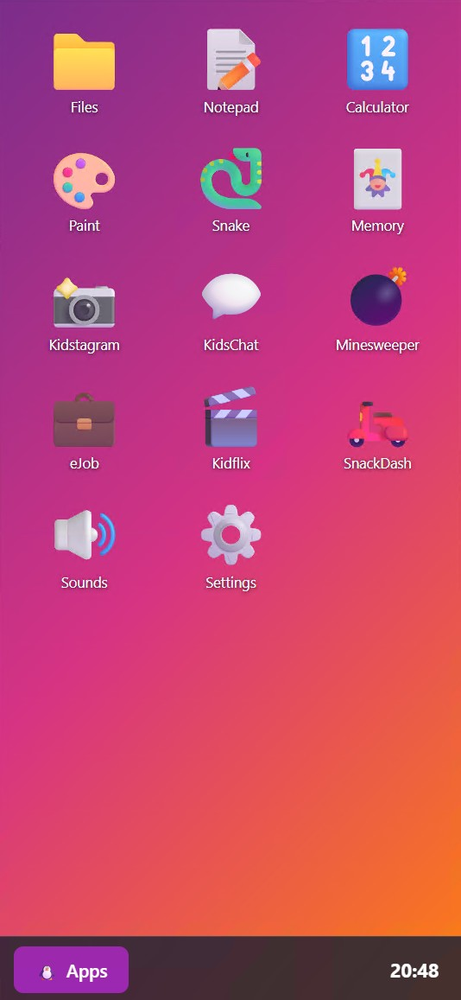

# KidsOS

A fun browser-based OS simulator for kids learning to use computers. Built with vanilla HTML, CSS, and JavaScript — no frameworks, no build tools, just open `index.html` and go.

## Features

- **Window Manager** — Draggable, resizable windows with minimize/maximize/close
- **Taskbar & App Menu** — Windows-style taskbar with clock and start menu
- **12 Apps** — Games, creativity tools, and silly parody apps
- **Dark/Light Theme** — With accent color picker
- **PWA Support** — Installable on Android, works offline
- **Virtual Filesystem** — Save files in localStorage
- **Fully Responsive** — Works on desktop, tablet, and mobile

## Apps

| App | Description |
|-----|-------------|
| **Files** | Virtual file manager with folders and file preview |
| **Notepad** | Rich text editor with font/size/color and save to OS |
| **Calculator** | 4-function calculator with %, square root, and more |
| **Paint** | Canvas drawing app, save to Pictures folder or download |
| **Snake** | Classic snake game with high score tracking |
| **Memory** | Card-flip matching game |
| **Minesweeper** | Simplified kids version with 3 difficulty levels |
| **Kidstagram** | Fake social network with procedural canvas art |
| **KidsChat** | Fake messaging app with auto-replying contacts |
| **eJob** | Executive email simulator — mash keys to send corporate replies |
| **SnackDash** | Fake food delivery app with silly restaurants and delivery tracking |
| **Kidflix** | Netflix-style movie browser with funny parody titles |
| **Soundboard** | 4x4 grid of fun sound effect buttons |

## Getting Started

1. Clone the repo
2. Open `index.html` in a browser
3. That's it!

No npm, no bundler, no server required. Works from the filesystem or any static host.

## Tech Stack

- Vanilla HTML/CSS/JavaScript
- localStorage for persistence
- Service Worker for offline PWA support
- Canvas API for Paint and Kidstagram

## License

MIT
