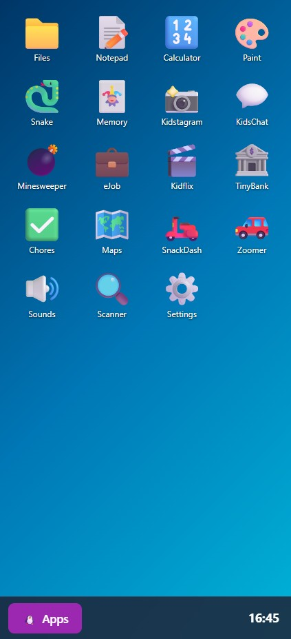
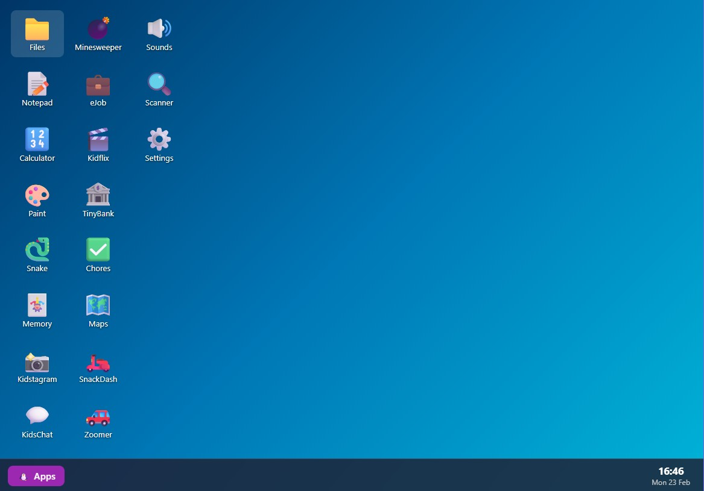

# KidsOS

A fun browser-based OS simulator for kids learning to use computers. Built with vanilla HTML, CSS, and JavaScript — no frameworks, no build tools.

## Features

- **Window Manager** — Draggable, resizable windows with minimize/maximize/close
- **Taskbar & App Menu** — Windows-style taskbar with clock and start menu
- **19 Apps** — Games, creativity tools, and silly parody apps
- **Dark/Light Theme** — With accent color picker
- **PWA Support** — Installable on Android and iOS, works offline
- **Virtual Filesystem** — Save files in localStorage
- **Fully Responsive** — Desktop experience on PC, phone-style launcher on mobile

## Apps

| App | Description |
|-----|-------------|
| **Files** | Virtual file manager with folders and file preview |
| **Notepad** | Rich text editor with font/size/color and save to OS |
| **Calculator** | 4-function calculator with %, square root, and more |
| **Paint** | Canvas drawing app, save to Pictures folder or download |
| **Snake** | Classic snake game with high score tracking |
| **Memory** | Card-flip matching game |
| **Minesweeper** | Simplified kids version with 3 difficulty levels |
| **Kidstagram** | Fake social network with procedural canvas art |
| **KidsChat** | Fake messaging app with auto-replying contacts |
| **eJob** | Executive email simulator — mash keys to send corporate replies |
| **SnackDash** | Fake food delivery app with silly restaurants and delivery tracking |
| **Kidflix** | Netflix-style movie browser with funny parody titles |
| **Soundboard** | 4x4 grid of fun sound effect buttons |
| **TinyBank** | Parody banking app with Giggle Coins currency |
| **ChoreQuest** | Chore checklist with timer and streaks |
| **TreasureMapper** | Parody maps app with silly navigation |
| **Zoomer** | Parody ride-hailing app with funny vehicles |
| **TinyScanner** | Object scanner with real camera and silly results |
| **Settings** | Username, wallpaper, theme, and update management |

## Installation

### Mobile (recommended)

Go to **https://mixashin.github.io/kidsOS/** on your phone's browser and install as an app:

**Android (Chrome):**
1. Open the link in Chrome
2. Tap the **three-dot menu** (top right)
3. Tap **"Add to Home screen"** or **"Install app"**
4. Tap **Install** to confirm
5. KidsOS will appear on your home screen as a full-screen app

**iPhone / iPad (Safari):**
1. Open the link in Safari
2. Tap the **Share button** (square with arrow at the bottom)
3. Scroll down and tap **"Add to Home Screen"**
4. Tap **Add** to confirm
5. KidsOS will appear on your home screen as a full-screen app

### Desktop

Open **https://mixashin.github.io/kidsOS/** in any browser — it runs as a desktop windowed experience. No install needed.

## Tech Stack

- Vanilla HTML/CSS/JavaScript
- localStorage for persistence
- Service Worker for offline PWA support
- Canvas API for Paint and Kidstagram
- getUserMedia API for live camera access in TinyScanner (rear camera on mobile, webcam on desktop)

## License

MIT
