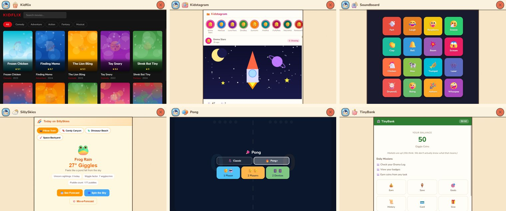

# KidsOS

A pretend operating system for children of age 5 to 9. It runs in the browser and as an installed app on tablets, phones, and PCs. Children learn how a computer works: they open apps, save files, change settings, and play.

KidsOS is built with plain HTML, CSS, and JavaScript. It has no framework, no account, and no server of its own.

**Try it: https://mixashin.github.io/kidsOS/**


| Phone | PC with a mouse | Serbian |
|---|---|---|
|  |  |  |



## Features

- **Home screen for touch**: on a tablet or phone, all apps are on one painted home screen. An app opens in full screen, with a Home button and a Close button
- **Desktop for mouse**: on a PC, apps open in windows that you can move and resize, with a taskbar and an app menu
- **25 apps**: games, tools to make things, and silly pretend apps
- **Two languages**: English and Serbian (Cyrillic). The Serbian texts are written for children, with their own jokes
- **Painted pictures**: each app has its own picture in a hand-painted style. Each device shows the same pictures
- **Private**: no trackers, no telemetry, no requests to other servers. All data stays on the device
- **Day and Night**: two themes, 6 painted wallpapers, 6 accent colors
- **Works offline**: install it on Android, iOS, or a PC. After the install, it needs no network
- **Game on two tablets**: Pong for two children on two devices in the same Wi-Fi, with no server between them
- **Virtual file system**: the child saves texts and drawings in folders. The files stay in the browser storage

## Apps

| App | Description |
|-----|-------------|
| **Files** | File manager with folders and a preview of each file |
| **Notepad** | Text editor with fonts, sizes, and colors |
| **Calculator** | Calculator with 4 functions and percent |
| **Paint** | Drawing app. Saves to the Pictures folder or to the device |
| **Snake** | The snake game, with a record |
| **Memory** | Card game: find the pairs |
| **Minesweeper** | Version for children with 3 levels |
| **Breakout** | Brick game with a paddle and a ball |
| **Pong** | For one player against the computer, for two players on one device, or for two players on two devices. Classic style, and Pong+ with trick shots and power-ups |
| **Sounds** | 16 buttons with funny sounds |
| **Kidstagram** | Pretend picture network. The app draws each picture |
| **KidsChat** | Pretend chat. Mom, Dad, and Grandma answer by themselves. A parent can write the answers |
| **eJob** | Pretend office mail: hit the keys, and the app writes a very serious answer |
| **SnackDash** | Pretend food delivery with silly restaurants |
| **Kidflix** | Film list with parody titles |
| **TinyBank** | Pretend bank with Giggle Coins |
| **Chores** | List of chores for the day, with a timer, stickers, and streaks |
| **Maps** | Pretend map app with silly places and a treasure hunt |
| **Zoomer** | Pretend ride app with funny vehicles |
| **Scanner** | Pretend object scanner. It uses the camera and gives silly results |
| **SillySkies** | Weather report for silly places |
| **Captain Cardio** | Exercise app on a starship |
| **Pebbles** | Pet rock. It does nothing, and the child cheers for it |
| **Pocket Pal** | Pet corgi in 3D |
| **Settings** | Language, name, wallpaper, theme, storage, and updates |

## Installation

### Tablet or phone (recommended)

Open **https://mixashin.github.io/kidsOS/** in the browser of the device and install it as an app.

**Android (Chrome):**
1. Open the link in Chrome
2. Tap the **menu with 3 dots** (top right)
3. Tap **"Add to Home screen"** or **"Install app"**
4. Tap **Install**

**iPhone or iPad (Safari):**
1. Open the link in Safari
2. Tap the **Share button**
3. Tap **"Add to Home Screen"**
4. Tap **Add**

KidsOS then starts from the home screen of the device, in full screen.

### PC

Open **https://mixashin.github.io/kidsOS/** in a browser. No install is necessary.

## Languages

A new device starts in English. To change the language, open **Settings**, then **Appearance**, then select **Српски** or **English**. The app starts again in the new language. Files, records, and coins of the child stay.

How the texts are stored:

- The English text in the code is the key. `js/lang.js` finds the text of the other language for it
- Each app has one table for each language: `js/lang/sr/<app>.js`. The app loads the table only when that language is on
- A text that has no entry shows in English

To add a language, add a folder `js/lang/<code>/` with one table for the shell (`os.js`) and one for each app, and add the language to `js/lang.js` and to Settings.

## Tech Stack

- Plain HTML, CSS, and JavaScript
- localStorage for the data of the child
- Service worker for offline use
- Canvas API for Paint, the games, and Kidstagram
- Camera (optional): Scanner shows the camera picture, and Pong reads the QR code of the other device. The app asks for the camera only when the child opens that function. No picture is stored or sent. The apps work with no camera, except the game on two devices
- WebRTC data channel for the game on two devices. The list of ICE servers is empty, so the connection uses addresses of the local network only
- QR code encoder and lockstep code are part of this repo (`js/lib/`), no library
- three.js (r149) for Pocket Pal, stored in `vendor/`, not loaded from a CDN

## Privacy

KidsOS is made for children. The app contacts only the server it was loaded from, and only to load its own files and to check for a new release. It has no analytics, no ads, no accounts, and no third-party scripts. Everything a child makes or types stays in the browser storage of the device.

Game on two devices: the two devices connect directly in the home Wi-Fi. There is no server between them, no STUN or TURN server, and no discovery service. The children pair the devices with a QR code that one screen shows and the other camera reads. The code holds a local network address and a certificate fingerprint. It is valid for one connection. The devices send paddle positions only.

## Development

Needs Node.js 20.12 or later. No packages to install.

```
python -m http.server 8080 --bind 127.0.0.1   # run the source files, no service worker
node build.mjs                                # build the deployable site into dist/
```

- The version number lives in `version.json` only. The build puts it everywhere else
- `sw.js` is a template. The build fills in the file list, so offline mode covers every file
- A push to `main` starts the GitHub Actions workflow, which builds `dist/` and publishes it to GitHub Pages
- All app files load as plain scripts into one scope. Keep the names of an app inside a block or a function

## Art

The app pictures, the penguin, the wallpapers, the coin, and the home screen icon are original pictures in a hand-painted style. An AI image tool made them for KidsOS. They use no stock picture and no character of a film, a game, or a book. The files are in `art/` and `icons/`. They are free to use under the license of this project.

## Font

The text font is Nunito (SIL Open Font License 1.1). The file is in `fonts/`, with the license text. The app loads it from its own site.

## License

MIT
