<div align="center">

# 🐧 KidsOS

### A pretend computer for real kids.

**25 silly apps · 0 ads · 0 accounts · 0 trackers · 1 extremely calm rock**

For kids of age 5 to 9. Built by a parent for two very demanding beta testers.

### 👉 [Try it now: mixashin.github.io/kidsOS](https://mixashin.github.io/kidsOS/) 👈

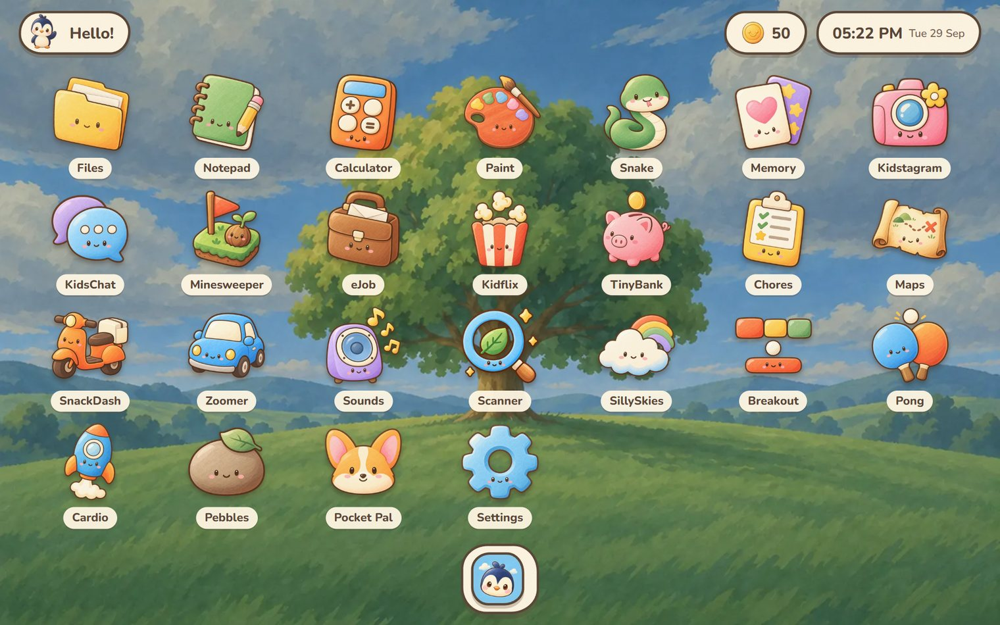

</div>

## 🧸 TL;DR (explain it like I'm 5)

> **KidsOS is a pretend computer that lives inside your tablet.**
>
> You can draw, write stories, play games, feed a puppy, and order pancakes from outer space.
> The pancakes are not real. The puppy is a little bit real. It is 3D.
>
> Everything you make stays in your tablet. It never goes on the internet.
> Not even that drawing of your big brother as a potato.

**For grown-ups, in one breath:** a free web app that installs like a normal app. No ads, no accounts, no in-app purchases, no trackers, no chat with strangers. After the first load it works with no internet. Everything the child makes stays on the device. The [privacy policy](#-privacy-policy) is below, and it is short, because there is not much to say.

## 🎒 What is inside?

25 apps. Some are useful. Some are silly. One is a rock.

### 🎨 Make stuff

| | App | What it does |
|---|---|---|
| 🎨 | **Paint** | Draw with all the colors. Save your masterpiece in the Pictures folder, like on a real computer. |
| 📝 | **Notepad** | Write stories, lists, and secret plans. Pick the font, the size, and the color. |
| 📁 | **Files** | Folders! A trash can! Learn where files go now, not at 11 PM before a school project. |
| 🧮 | **Calculator** | Adds, subtracts, and does percent. It does not do homework. We asked. |
| 📸 | **Kidstagram** | A pretend picture app. Every picture gets likes. Nobody real sees it, and that is the point. |

### 🕹️ Play

| | App | What it does |
|---|---|---|
| 🐍 | **Snake** | Eat. Grow. Do not bite yourself. Beat your record. |
| 🃏 | **Memory** | Find the pairs. Grown-ups will lose. |
| 💣 | **Minesweeper** | The classic, with an easy level for small humans. |
| 🧱 | **Breakout** | Paddle. Ball. Bricks. Smash. |
| 🏓 | **Pong** | Play the computer, a friend on the same tablet, or a friend on a second tablet. Pong+ has trick shots and power-ups. |
| 🔊 | **Sounds** | 16 buttons of pure noise. Yes, there is a fart button. You have been warned. |

### 🤵 Pretend grown-up apps

| | App | What it does |
|---|---|---|
| 🍿 | **Kidflix** | Films like *Frozen Chicken*, *Toy Snory*, and *Spider-Man: No Way Homework*. |
| 🛵 | **SnackDash** | Order *Burgers & Boogers* or a *Black Hole Donut*. Today's news: 847 socks recovered from Sock Mountain. |
| 🚗 | **Zoomer** | Book a *T-Rex Taxi* or a *Unicorn Unicycle* to Pillow Fort Plaza. The app is honest about it: "No real rides. No real drivers. You're not going anywhere." |
| 💼 | **eJob** | The Executive Email Simulator. Mash the keyboard, and it types very serious office answers to Mom and Grandma. |
| 🐷 | **TinyBank** | Save your Giggle Coins. Breaking news: the piggy bank workers' union is on strike. |
| 🗺️ | **Maps** | Find Couch Cushion Canyon, Mount Fridgemore, and a buried treasure. |
| 🌈 | **SillySkies** | Today: Glitter Snow, 14° Sparkles. Feels like a craft store exploded. Watch out for the Meatball Blizzard. |
| 🔍 | **Scanner** | Point the camera at a thing. Result: 84% potato, 10% spaceship, 6% silent but suspicious. |
| 💬 | **KidsChat** | Text Mom, Dad, Grandma, and Best Friend. They answer by themselves. Grown-ups can write the answers. |
| ✅ | **Chores** | Morning quests (brush teeth, make bed, get dressed) with a timer, stickers, and streaks. Tip from the app: matching socks = bonus points. |
| 🚀 | **Cardio** | Captain Cardio's exercises on a starship. "Engage star-jump thrusters!" |

### 🐾 Very important pets

| | App | What it does |
|---|---|---|
| 🐶 | **Pocket Pal** | A 3D corgi. Give it a name, then feed it, play with it, give it a bath, and put it to bed. Boop! |
| 🪨 | **Pebbles** | A pet rock. It does nothing. Its needs: "Zero. Zilch. Nada." Your job is to cheer for it. |
| ⚙️ | **Settings** | Your name, the wallpaper, Day or Night, the language, and even a pretend clock. |

## 📱 Pictures

| Kidflix | SnackDash | SillySkies | Sounds |
|---|---|---|---|
| 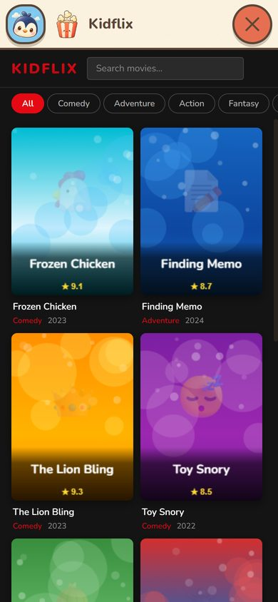 | 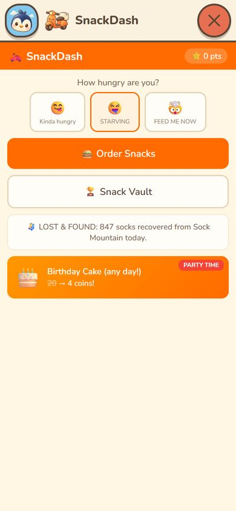 | 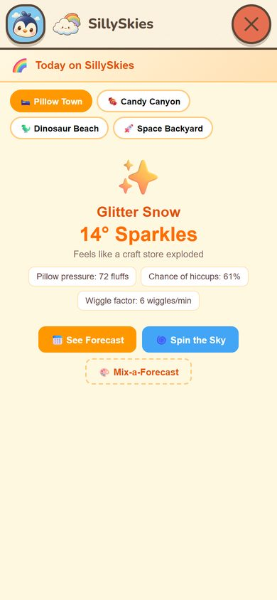 | 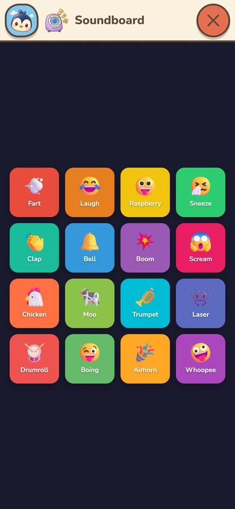 |
| **Pebbles** | **Pocket Pal** | **Kidstagram** | **Zoomer** |
| 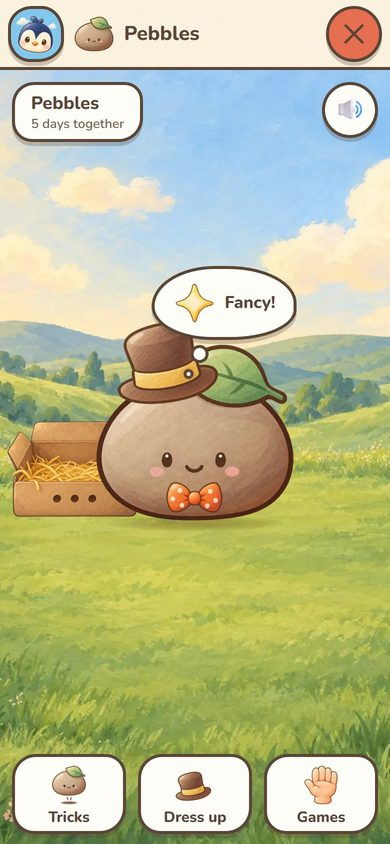 | 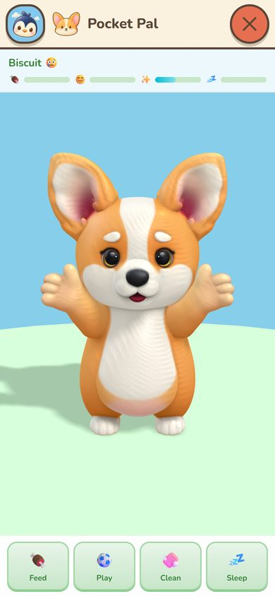 | 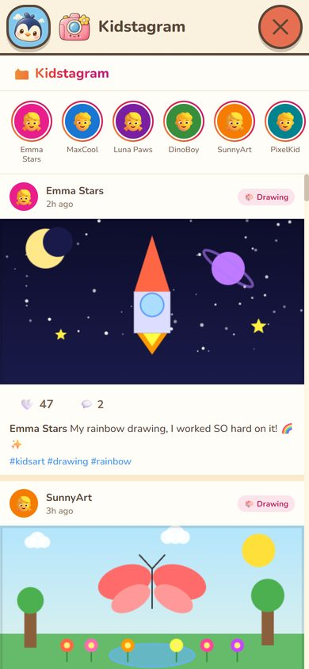 | 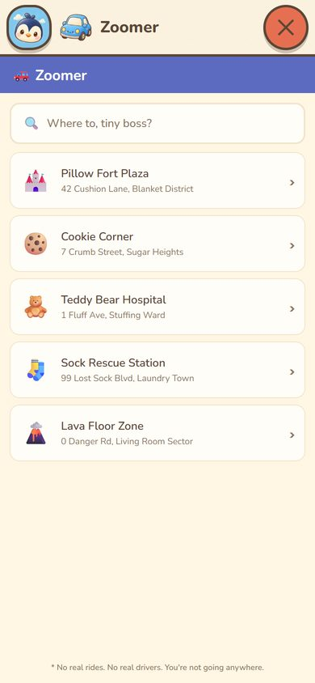 |

It fits the device it runs on:

| Phone | PC with a mouse | Serbian |
|---|---|---|
| 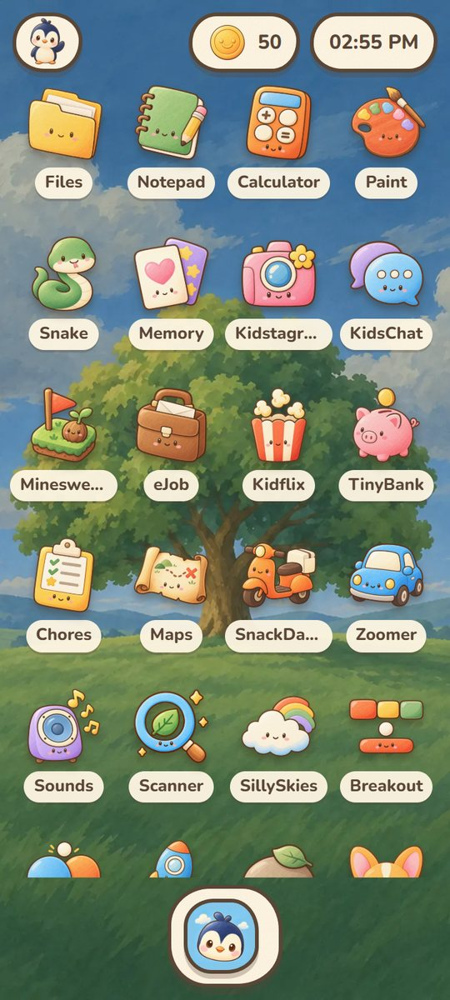 | 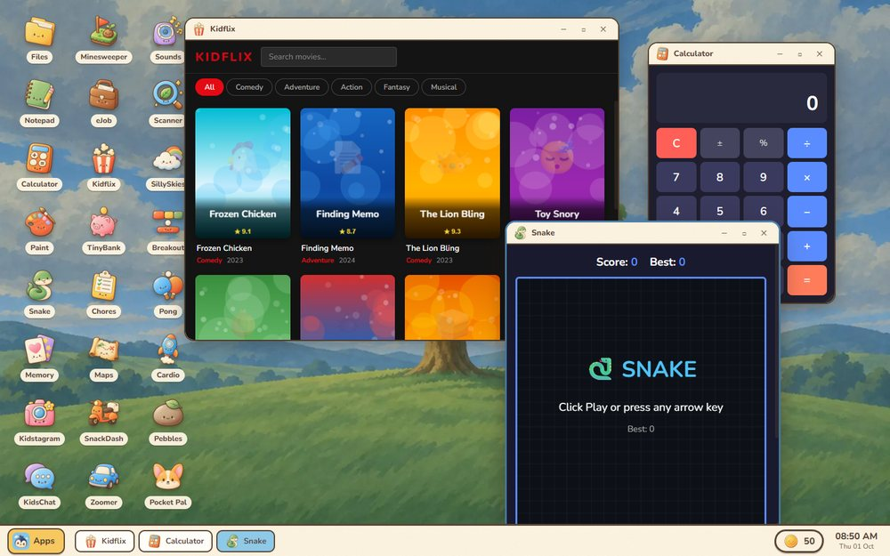 | 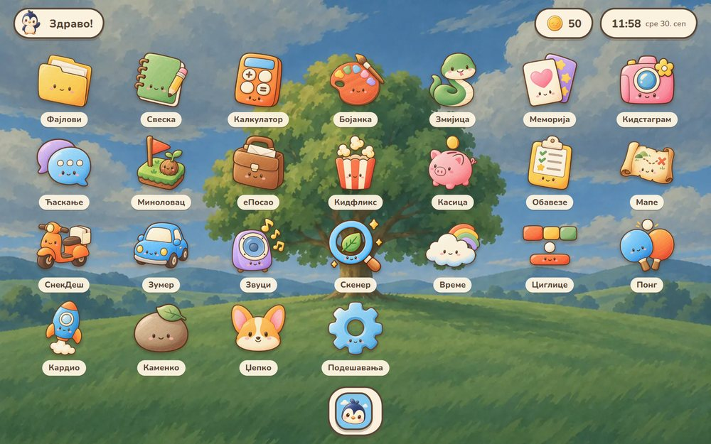 |

## ✨ Why grown-ups like it too

- **Works offline.** Car trips, planes, Grandma's house with no Wi-Fi. After the install it needs no network.
- **Nothing to buy, nobody to meet.** No ads, no in-app purchases, no accounts, no real people in the chat.
- **Real computer skills, in disguise.** Open an app, move a window, save a file into a folder, empty the trash, change a setting.
- **Touch and mouse.** On a tablet or phone it is a home screen with big pictures. On a PC it is a desktop with windows, a taskbar, and an app menu.
- **Two languages.** English and Serbian (Cyrillic). The Serbian texts are written for kids and have their own jokes.
- **Hand-painted look.** Every app has its own painted picture, and it looks the same on every device.
- **Pong on two tablets.** Two kids, two tablets, one home Wi-Fi. No server in between.

## 🔒 Privacy policy

**The short version: KidsOS collects nothing.** No name, no email, no photos, no location, no usage data. There is nothing to collect it with, and nowhere to send it.

The long version:

1. **What KidsOS collects:** nothing. It has no analytics, no telemetry, no crash reports, no ads, no cookies, and no accounts. It loads no script, font, or picture from another company.
2. **Where the child's data lives:** in the browser storage (localStorage) of that one device. That is the files, drawings, name, scores, coins, chat texts, and settings. There is no copy anywhere else and no sync.
3. **What goes over the network:** only requests to the site the app came from (`mixashin.github.io/kidsOS`). The app loads its own files there, and it checks a small `version.json` file for a new version. That is all.
4. **The host:** GitHub Pages serves the files. Like every web host, GitHub sees the IP address of a device that downloads the files, and it logs it for security ([GitHub's note about this](https://docs.github.com/en/pages/getting-started-with-github-pages/about-github-pages#data-collection)). KidsOS cannot turn that off. After the install, the app runs from the device, so it contacts GitHub only to check for updates.
5. **The camera:** only Scanner and two-tablet Pong use it. The browser asks for permission first. Scanner holds the picture in memory while it shows the joke result, then forgets it. It saves only the text of the result. Pong reads a QR code and saves nothing. No picture is stored, and no picture is sent. All other apps work with no camera.
6. **Two-tablet Pong:** the two tablets talk directly over the home Wi-Fi (WebRTC). There is no server between them: no STUN or TURN server, no matchmaking, no account. The kids pair the tablets with a QR code. The code holds a local network address and a certificate fingerprint, and it works for one game only. The tablets send paddle positions, nothing else.
7. **No real people:** KidsChat, Kidstagram, eJob, SnackDash, and Zoomer are pretend. Every answer, like, and delivery comes from the app itself. A child cannot contact anybody, and nobody can contact the child.
8. **Delete everything:** Settings → Storage → Factory Reset. It asks two times, because kids. You can also remove the app, or clear the site data in the browser.
9. **Changes to this policy:** this policy lives in this file. Each change is in the git history of the project.
10. **Questions:** open an issue on GitHub.

## ⚙️ How it works (for curious grown-ups)

KidsOS is a web page that pretends to be an operating system. It is a static site: there is no server code, only files.

- **Plain HTML, CSS, and JavaScript.** No framework, no npm packages, no build dependencies. The build script uses Node.js only.
- **One shell, two modes.** A touch device gets the home screen: each app opens in full screen, with a Home button and a Close button. A mouse gets the desktop: windows that you can move and resize, a taskbar, and an app menu.
- **Offline first.** A service worker stores every file of the app at the install. The build writes the file list, so no file is left out.
- **Updates.** When a new version is on the site, the app shows a popup. One tap, and the new version starts. The child's data stays.
- **Pretend file system.** Folders (Documents, Pictures, Music, Videos, Trash) and files live in localStorage. Paint and Notepad save into them, and the Files app shows them.
- **Canvas** draws Paint, the games, and the pictures of Kidstagram.
- **three.js (r149)** draws the 3D corgi. The library is stored in `vendor/`, not loaded from a CDN.
- **WebRTC data channel** carries two-tablet Pong. The list of ICE servers is empty, so the connection uses local network addresses only. The QR code encoder and the lockstep game code are part of this repo (`js/lib/`).
- **Languages.** The English text in the code is the key. Each app has one table for each other language (`js/lang/sr/<app>.js`), which the app loads only when that language is on. A text with no entry shows in English.

## 📲 Install

### Tablet or phone (recommended)

Open **https://mixashin.github.io/kidsOS/** in the browser of the device and install it as an app.

**Android (Chrome):**
1. Open the link in Chrome.
2. Tap the **menu with 3 dots** (top right).
3. Tap **"Add to Home screen"** or **"Install app"**.
4. Tap **Install**.

**iPhone or iPad (Safari):**
1. Open the link in Safari.
2. Tap the **Share button**.
3. Tap **"Add to Home Screen"**.
4. Tap **Add**.

KidsOS then starts from the home screen of the device, in full screen.

### PC

Open **https://mixashin.github.io/kidsOS/** in a browser. No install is necessary.

## 🗣️ Languages

A new device starts in English. To change the language, open **Settings**, then **Appearance**, then select **Српски** or **English**. The app starts again in the new language. Files, records, and coins stay.

To add a language, add a folder `js/lang/<code>/` with one table for the shell (`os.js`) and one for each app, and add the language to `js/lang.js` and to Settings.

## 🛠️ Development

Needs Node.js 20.12 or later. No packages to install.

```
python -m http.server 8080 --bind 127.0.0.1   # run the source files, no service worker
node build.mjs                                # build the deployable site into dist/
```

- The version number lives in `version.json` only. The build puts it everywhere else.
- `sw.js` is a template. The build fills in the file list, so offline mode covers every file.
- A push to `main` starts the GitHub Actions workflow, which builds `dist/` and publishes it to GitHub Pages.
- All app files load as plain scripts into one scope. Keep the names of an app inside a block or a function.

## 🖼️ Art and font

The app pictures, the penguin, the wallpapers, the coin, and the home screen icon are original pictures in a hand-painted style. An AI image tool made them for KidsOS. They use no stock picture and no character of a film, a game, or a book. The files are in `art/` and `icons/`, free to use under the license of this project.

The text font is Nunito (SIL Open Font License 1.1). The file is in `fonts/`, with the license text. The app loads it from its own site.

## 📜 License

MIT. Share it, change it, give it to your kids. The rock stays calm either way.

---

<div align="center">

*Dedicated with love to the two biggest joys of my life.*


***Thank you for existing!***

**Dad**

</div>
