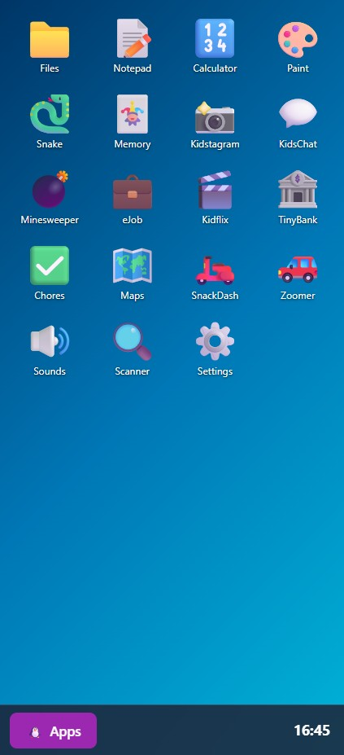
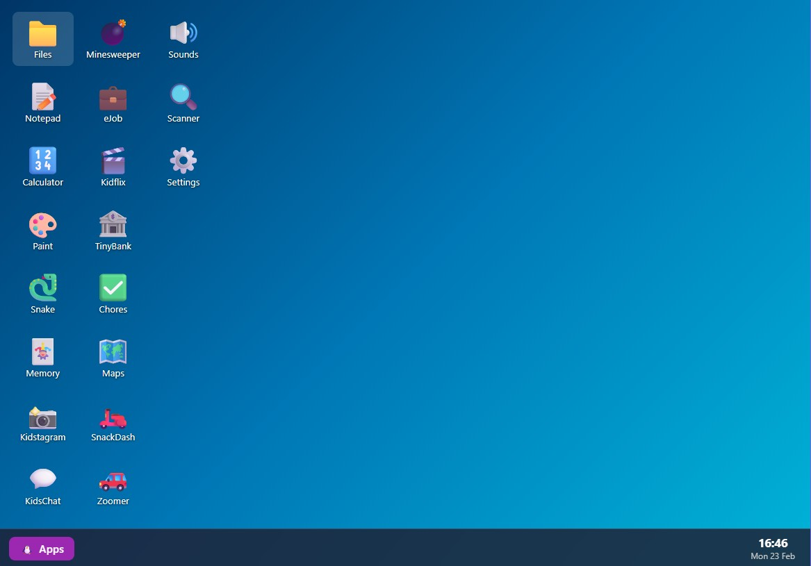

# KidsOS

A fun browser-based OS simulator for kids learning to use computers. Built with vanilla HTML, CSS, and JavaScript — no frameworks, no dependencies.



[](https://youtu.be/ifZQ23GNZSk)

## Features

- **Window Manager** — Draggable, resizable windows with minimize/maximize/close
- **Taskbar & App Menu** — Windows-style taskbar with clock and start menu
- **24 Apps** — Games, creativity tools, and silly parody apps
- **Private** — No trackers, no telemetry, no requests to other servers. All data stays on the device
- **Dark/Light Theme** — With accent color picker
- **PWA Support** — Installable on Android and iOS, works offline
- **Virtual Filesystem** — Save files in localStorage
- **Fully Responsive** — Desktop experience on PC, phone-style launcher on mobile

## Apps

| App | Description |
|-----|-------------|
| **Files** | Virtual file manager with folders and file preview |
| **Notepad** | Rich text editor with font/size/color and save to OS |
| **Calculator** | 4-function calculator with %, square root, and more |
| **Paint** | Canvas drawing app, save to Pictures folder or download |
| **Snake** | Classic snake game with high score tracking |
| **Memory** | Card-flip matching game |
| **Minesweeper** | Simplified kids version with 3 difficulty levels |
| **Kidstagram** | Fake social network with procedural canvas art |
| **KidsChat** | Fake messaging app with auto-replying contacts |
| **eJob** | Executive email simulator — mash keys to send corporate replies |
| **SnackDash** | Fake food delivery app with silly restaurants and delivery tracking |
| **Kidflix** | Netflix-style movie browser with funny parody titles |
| **Soundboard** | 4x4 grid of fun sound effect buttons |
| **TinyBank** | Parody banking app with Giggle Coins currency |
| **ChoreQuest** | Chore checklist with timer and streaks |
| **TreasureMapper** | Parody maps app with silly navigation |
| **Zoomer** | Parody ride-hailing app with funny vehicles |
| **TinyScanner** | Object scanner with real camera and silly results |
| **SillySkies** | Parody weather app for silly places |
| **Breakout** | Classic brick breaker game |
| **Captain Cardio** | Starship fitness app with exercise moves |
| **Pebbles** | Virtual pet rock |
| **Pocket Pal** | Virtual pet corgi in 3D |
| **Settings** | Username, wallpaper, theme, and update management |

## Installation

### Mobile (recommended)

Go to **https://mixashin.github.io/kidsOS/** on your phone's browser and install as an app:

**Android (Chrome):**
1. Open the link in Chrome
2. Tap the **three-dot menu** (top right)
3. Tap **"Add to Home screen"** or **"Install app"**
4. Tap **Install** to confirm
5. KidsOS will appear on your home screen as a full-screen app

**iPhone / iPad (Safari):**
1. Open the link in Safari
2. Tap the **Share button** (square with arrow at the bottom)
3. Scroll down and tap **"Add to Home Screen"**
4. Tap **Add** to confirm
5. KidsOS will appear on your home screen as a full-screen app

### Desktop

Open **https://mixashin.github.io/kidsOS/** in any browser — it runs as a desktop windowed experience. No install needed.

## Tech Stack

- Vanilla HTML/CSS/JavaScript
- localStorage for persistence
- Service Worker for offline PWA support
- Canvas API for Paint and Kidstagram
- getUserMedia API (optional) — used only in TinyScanner as a camera passthrough for the fake object scanner. Camera access is requested only when the app is opened and only if the user grants permission. No photos are stored, uploaded, or sent anywhere. The app works without camera access (falls back to a static background).

- three.js (r149) for Pocket Pal, stored in `vendor/`, not loaded from a CDN

## Privacy

KidsOS is made for children. The app contacts only the server it was loaded from, and only to load its own files and to check for a new release. It has no analytics, no ads, no accounts, and no third-party scripts. Everything a child makes or types stays in the browser storage of the device.

## Development

Needs Node.js 20.12 or later. No packages to install.

```
python -m http.server 8080 --bind 127.0.0.1   # run the source files, no service worker
node build.mjs                                # build the deployable site into dist/
```

- The version number lives in `version.json` only. The build puts it everywhere else.
- `sw.js` is a template. The build fills in the file list, so offline mode covers every file.
- A push to `main` starts the GitHub Actions workflow, which builds `dist/` and publishes it to GitHub Pages.

## License

MIT
